# 佛教趋势

## 核心结论

如果只看“正式宗教身份认同”，佛教确实是 2010-2020 年间全球主要宗教中少见的绝对人数下降者。Pew Research Center 2025 年报告估计，全球佛教徒从 2010 年的约 3.43 亿下降到 2020 年的约 3.24 亿，减少约 5%。下降主要发生在东亚，尤其是中国和日本；北美和欧洲的佛教徒人数则因移民和本土转化有所增长。[1]

但这个判断必须加一个很重要的前提：这里说的是“正式身份认同”的佛教徒，不等于佛教文化、寺庙实践、祖先祭祀、正念禅修或民间信仰中的佛教影响力。东亚社会尤其如此。很多人相信佛菩萨、烧香、拜庙、参加佛教仪式，却不会在问卷中回答“我的宗教是佛教”。因此，佛教的制度人口在下降，不等于佛教作为文化资源和修行技术正在全面消失。

更准确的总判断是：

1. 大乘佛教的传统核心区，尤其是中国、日本、韩国、台湾，受到低生育率、老龄化、宗教身份淡化和世俗化的共同影响，正式身份人数承压。
2. 上座部佛教的传统核心区，尤其是泰国、缅甸、斯里兰卡、柬埔寨、老挝，人口基础仍相对稳固，但泰国、斯里兰卡也开始面对少子化。
3. 藏传佛教在藏族、蒙古族、不丹、蒙古国和俄罗斯部分共和国中具有强民族文化黏性，不能简单套用汉地佛教的身份淡化模型。
4. 亚洲以外的佛教增长主要来自两条线：亚洲移民把寺庙和社群带到欧美澳；西方本土知识阶层通过禅宗、藏传、内观和正念接触佛教。
5. “正念”和“内观”的流行增强了上座部传统的文化影响力，但不应直接等同于上座部皈依人数增长。

---

## 统计口径：先分清“信徒”是什么意思

佛教人口数据最容易混乱，因为不同来源问的不是同一个问题。后文所有数字都应按口径理解，而不是简单相加。

|口径|它统计的是什么|优点|局限|典型来源|
|---|---|---|---|---|
|正式宗教身份|问卷或普查中回答“我是佛教徒”的人|适合跨国比较|低估东亚的混合信仰和文化实践|Pew、各国人口普查|
|佛菩萨信仰|相信佛、菩萨或相关神圣存在的人|更贴近中国民间现实|可能与道教、民间信仰、基督教等重叠|CFPS、Pew 中国报告|
|仪式/实践参与|烧香、拜佛、去寺庙、参加法会、禅修的人|能反映佛教社会影响力|很难判断是否是“佛教徒”身份|地方调查、寺院数据|
|宗派归属|大乘、上座部、金刚乘、新佛教等|适合分析佛教内部结构|多数国家普查不问宗派，只能估算|学术研究、宗教组织、二手数据库|
|寺院/僧伽数据|寺庙、僧尼、协会、活动场所|可反映制度化强度|不等于信众人数|政府宗教事务报告、佛教协会|

因此，笔记中应避免三类错误：

1. 把 Pew 2025 的全球 3.24 亿，和 Pew 2012 的 4.88 亿直接比较。这两个数字背后的数据修订和测量口径不同。
2. 把中国“正式认同佛教”的 4200 万，和“相信佛/菩萨”的 3.62 亿当成同一层级。
3. 把参加正念课程、内观营、禅修班的人直接算作上座部佛教徒。

---

## 全球总趋势

Pew 2025 年报告给出的关键数据如下：

|指标|2010|2020|变化|
|---|---:|---:|---:|
|全球佛教徒数量|约 3.43 亿|约 3.24 亿|约 -5%|
|全球人口变化|约 +13%|--|佛教占世界人口比例下降|
|亚太佛教徒|--|约 3.16 亿|2010-2020 下降约 6%|
|北美佛教徒|--|约 500 万|2010-2020 增长约 27%|
|欧洲佛教徒|--|约 250 万|2010-2020 增长约 26%|

Pew 的解释很清楚：佛教下降主要来自两个因素。一是东亚佛教徒的宗教身份淡化，很多曾被家庭或文化环境视为佛教徒的人，在现代问卷中转向“无宗教”或不再认同佛教身份。二是佛教徒高度集中在老龄化、低生育率地区，尤其是东亚。[1]

Pew 2025 还指出，2020 年全球佛教徒中约 98% 居住在亚太地区。亚洲以外虽然有增长，但基数太小，无法抵消东亚下降。[1]

### 重要修正：全球第一大佛教国家取决于口径

旧口径下，Pew 2012 曾估计全球约一半佛教徒在中国，全球佛教徒总量约 4.88 亿。[2] 但 Pew 2025 的 2020 正式身份口径中，泰国约 6800 万佛教徒，占全国约 94%；中国约 5300 万，占全国约 4%。[1]

所以，“中国是全球佛教徒最多的国家”只在广义文化/信仰口径下成立；在 Pew 2025 的正式宗教身份口径下，泰国是第一，中国是第二。

### 全球总表

这张表采用 Pew 2025 的 2020 年正式宗教身份口径。宗派结构是综合各地区历史传统、移民构成和宗教组织资料后的结构判断，不是 Pew 官方宗派普查。

|区域|佛教徒总数|占全球佛教徒比例|上座部/南传|大乘/金刚乘/其他|核心趋势|
|---|---:|---:|---:|---:|---|
|亚太地区|约 3.16 亿|约 98%|约 1.5 亿上下，集中在泰国、缅甸、斯里兰卡、柬埔寨、老挝，并包括印度新佛教和云南南传等|约 1.6 亿上下，集中在中国、日本、越南、韩国、台湾、藏区等|全球佛教的绝对主体；东亚大乘身份下降抵消了东南亚上座部的稳定。|
|北美洲|约 500 万|约 1.5%|约 15%-20%|约 80%-85%|亚洲移民寺庙和本土禅修/正念双轨增长。|
|欧洲|约 250 万|约 0.8%|约 20%-30%|约 70%-80%|移民佛教、藏传中心、禅宗、内观和正念共同扩散。|
|大洋洲|约 65 万-70 万|约 0.2%|约 35%-40%|约 60%-65%|澳大利亚和新西兰受亚洲移民影响明显，上座部占比高于欧美平均。|
|拉丁美洲|约 40 万-50 万|约 0.1%-0.2%|极少|近 95%|日本移民后裔和本土化日本佛教是主体，巴西最重要。|
|非洲|约 25 万|不足 0.1%|约 60%-70%，多与南亚、斯里兰卡、毛里求斯移民相关|约 30%-40%|总体规模小，南非、毛里求斯和华人佛教组织较突出。|
|全球合计|约 3.24 亿|100%|约 1.5 亿以上，但宗派口径不稳定|约 1.7 亿上下，但宗派口径不稳定|2010-2020 年下降约 5%；下降主要来自东亚正式身份流失。|

### 全球与大洲历史趋势

全球和大洲层面，最可比的一组历史数据是 Pew 的 2010-2020 正式宗教身份口径。Pew 2012 的 2010 旧报告曾给出更高的全球佛教徒估计（约 4.88 亿），但 Pew 2025 对数据和模型做了更新，因此正文趋势以 Pew 2025 的 2010-2020 可比序列为主。

下面的折线图只使用真实统计断点或权威模型断点；Pew 只有 2010 与 2020 两个可比点，就只画两个点，不再插值为每年数据。

|区域|最早断点|最新断点|变化|解释|
|---|---:|---:|---:|---|
|全球|2010：约 3.43 亿|2020：约 3.24 亿|约 -5%|唯一出现绝对人数下降的主要宗教群体；下降集中在东亚。|
|亚太地区|2010：约 3.36 亿上下|2020：约 3.16 亿|约 -6%|全球佛教徒约 98% 在亚太；中国、日本、韩国等正式身份下降是主因。|
|北美洲|2010：约 390 万|2020：约 500 万|约 +27%|亚洲移民和本土禅修/正念推动小基数增长。|
|欧洲|2010：约 200 万|2020：约 250 万|约 +26%|移民佛教、藏传中心、禅宗和内观网络共同扩散。|
|大洋洲|2010：约 60 万上下|2020：约 65 万-70 万|温和增长|澳大利亚和新西兰的亚洲移民推动增长。|
|拉丁美洲|2010：约 40 万上下|2020：约 40 万-50 万|大致稳定或小幅增长|日本移民后裔和本土化日本佛教为主体。|
|非洲|2010：约 20 万上下|2020：约 25 万|小幅增长|基数很小，主要由南亚、斯里兰卡、华人和毛里求斯相关社群构成。|

图例：

|曲线|代表对象|
|---|---|
|全球|全球佛教徒总数|
|亚太|亚洲-太平洋地区佛教徒总数|
|北美|北美洲佛教徒总数|
|欧洲|欧洲佛教徒总数|
|大洋洲|澳大利亚、新西兰及太平洋地区佛教徒总数|
|拉美|拉丁美洲及加勒比地区佛教徒总数|
|非洲|非洲佛教徒总数|

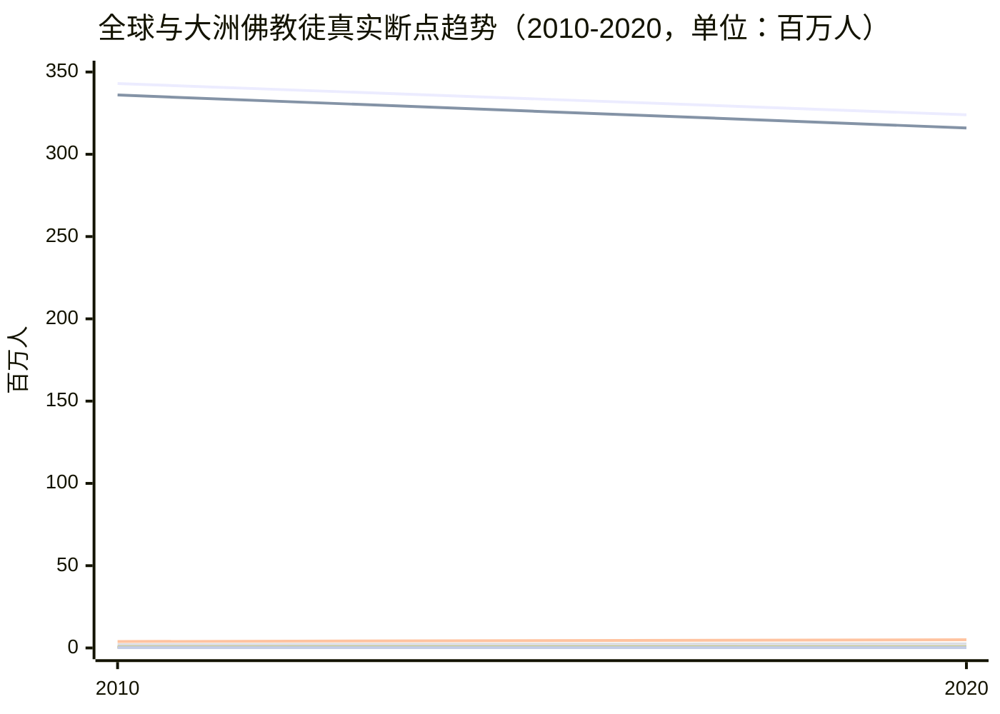
```mermaid
xychart-beta
    title "全球与大洲佛教徒真实断点趋势（2010-2020，单位：百万人）"
    x-axis [2010, 2020]
    y-axis "百万人" 0 --> 350
    line "全球" [343, 324]
    line "亚太" [336, 316]
    line "北美" [3.9, 5.0]
    line "欧洲" [2.0, 2.5]
    line "大洋洲" [0.6, 0.68]
    line "拉美" [0.4, 0.45]
    line "非洲" [0.2, 0.25]
```

由于全球和亚太规模远大于其他地区，上图会压扁欧美澳拉非的小曲线。下面把亚洲以外地区单独放大：

图例：

|曲线|代表对象|
|---|---|
|北美|北美洲佛教徒总数|
|欧洲|欧洲佛教徒总数|
|大洋洲|澳大利亚、新西兰及太平洋地区佛教徒总数|
|拉美|拉丁美洲及加勒比地区佛教徒总数|
|非洲|非洲佛教徒总数|

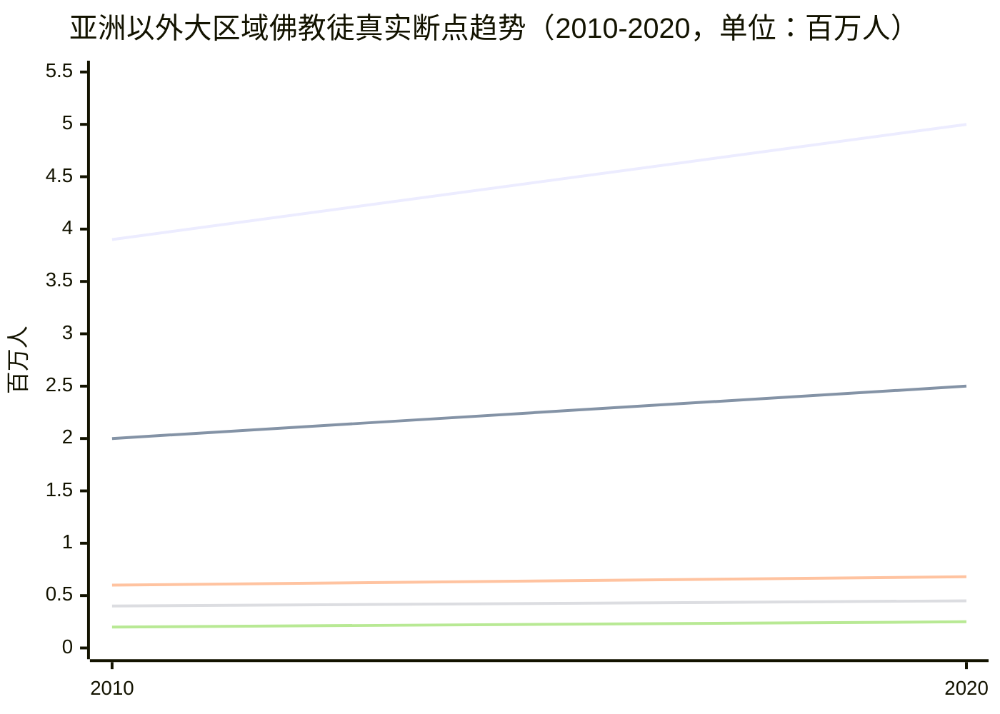
```mermaid
xychart-beta
    title "亚洲以外大区域佛教徒真实断点趋势（2010-2020，单位：百万人）"
    x-axis [2010, 2020]
    y-axis "百万人" 0 --> 5.5
    line "北美" [3.9, 5.0]
    line "欧洲" [2.0, 2.5]
    line "大洋洲" [0.6, 0.68]
    line "拉美" [0.4, 0.45]
    line "非洲" [0.2, 0.25]
```

**全球趋势总结：** 2010-2020 年的关键不是“佛教在所有地方都衰退”，而是“亚太下降压过了欧美澳的小基数增长”。佛教在西方的可见度上升，尤其是正念、禅修、藏传中心和亚洲移民寺庙；但由于全球佛教徒过度集中在东亚和东南亚，东亚的身份流失和人口老化决定了全球总盘。

### 全球三大传统分支趋势

佛教传统分支没有像“宗教身份”那样的全球统一普查。下面的汉传/东亚大乘、藏传/金刚乘、上座部曲线，是依据 2010 年学术常用比例（东亚大乘约 53%、藏传/金刚乘约 6%、上座部约 36%）和 2020 年 Pew 国家数据结构重新估算得出。[1][22] 它适合判断结构方向，不适合当作精确人口普查。

这里的“汉传佛教”采用广义“东亚大乘/汉字文化圈佛教”口径，核心包括中国大陆、台湾、日本、韩国、越南以及海外华人、越南人、日裔、韩裔佛教社群；它不是只统计中国汉族佛教徒。

|传统分支|2010 结构性估算|2020 结构性估算|变化|主要分布|
|---|---:|---:|---:|---|
|全球佛教总数|约 3.43 亿|约 3.24 亿|约 -5%|全球，约 98% 在亚太|
|汉传/东亚大乘|约 1.82 亿|约 1.45 亿-1.55 亿|明显下降|中国大陆、台湾、日本、韩国、越南、北美/欧洲/澳洲华人和越南裔社群|
|藏传/金刚乘|约 2,000 万上下|约 1,800 万-2,200 万|大致稳定，数据不确定|西藏及藏区、蒙古、不丹、尼泊尔喜马拉雅地区、俄罗斯卡尔梅克/布里亚特/图瓦、西方藏传中心|
|上座部/南传|约 1.23 亿|约 1.55 亿-1.60 亿|上升|泰国、缅甸、斯里兰卡、柬埔寨、老挝、云南南传民族区、海外东南亚移民社群|
|其他/混合/新佛教|约 1,500 万-2,000 万|约 1,000 万-2,000 万|口径不稳定|印度 Navayana、新兴佛教运动、跨宗派/世俗化修行者|

图例：

|曲线|代表对象|
|---|---|
|全球总数|所有正式身份佛教徒|
|汉传/东亚大乘|中国、日本、韩国、越南、台湾及海外东亚大乘社群的结构性估算|
|藏传/金刚乘|藏区、蒙古、不丹、喜马拉雅、俄罗斯佛教地区及海外藏传中心的结构性估算|
|上座部/南传|东南亚、斯里兰卡、云南南传和海外上座部社群的结构性估算|

四张单独趋势图：

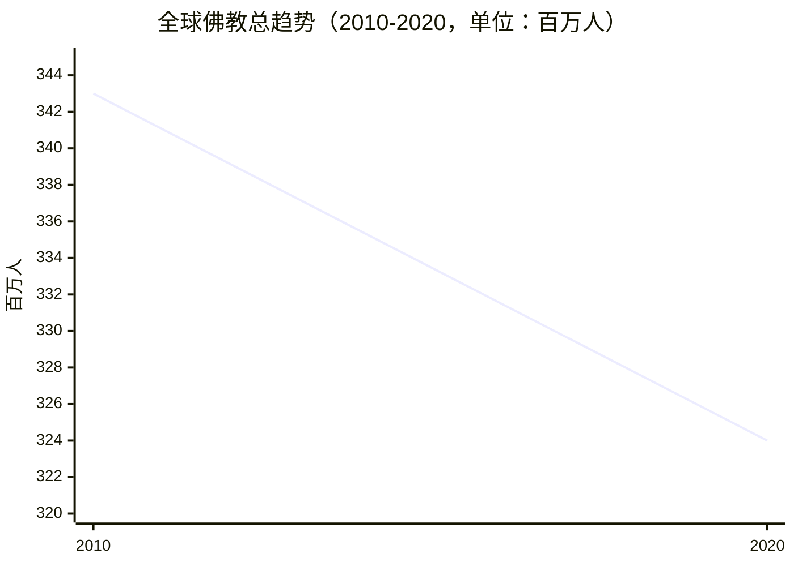
```mermaid
xychart-beta
    title "全球佛教总趋势（2010-2020，单位：百万人）"
    x-axis [2010, 2020]
    y-axis "百万人" 320 --> 345
    line [343, 324]
```

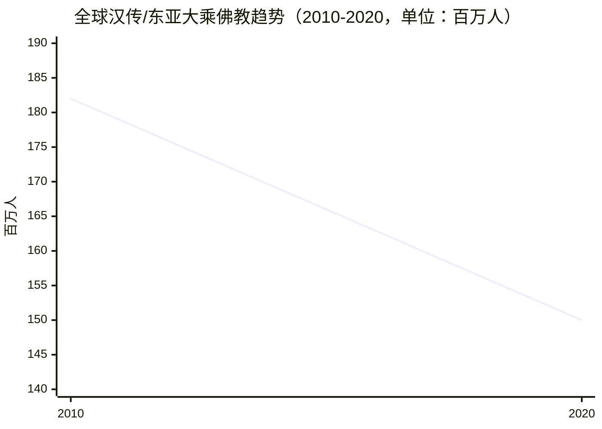
```mermaid
xychart-beta
    title "全球汉传/东亚大乘佛教趋势（2010-2020，单位：百万人）"
    x-axis [2010, 2020]
    y-axis "百万人" 140 --> 190
    line [182, 150]
```

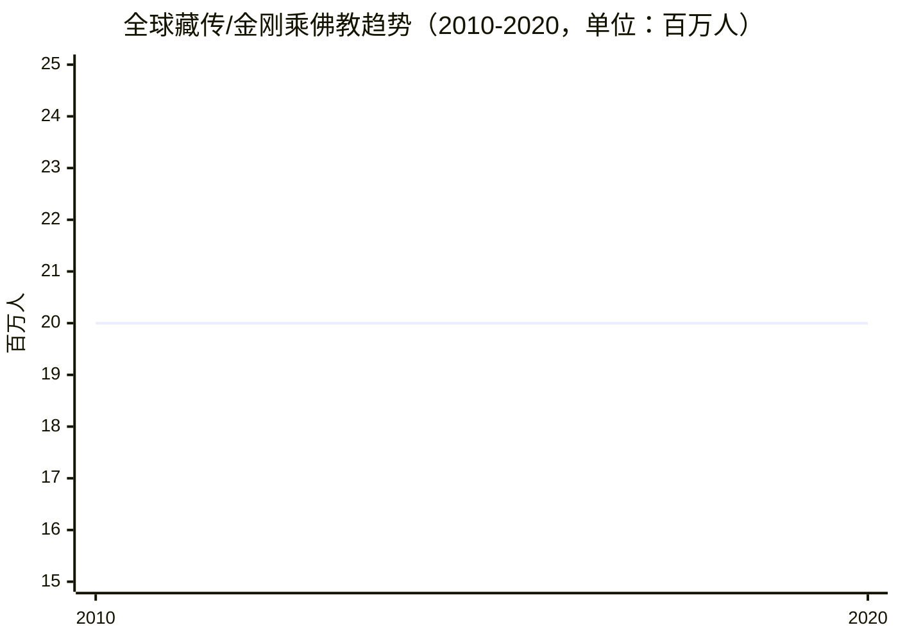
```mermaid
xychart-beta
    title "全球藏传/金刚乘佛教趋势（2010-2020，单位：百万人）"
    x-axis [2010, 2020]
    y-axis "百万人" 15 --> 25
    line [20, 20]
```

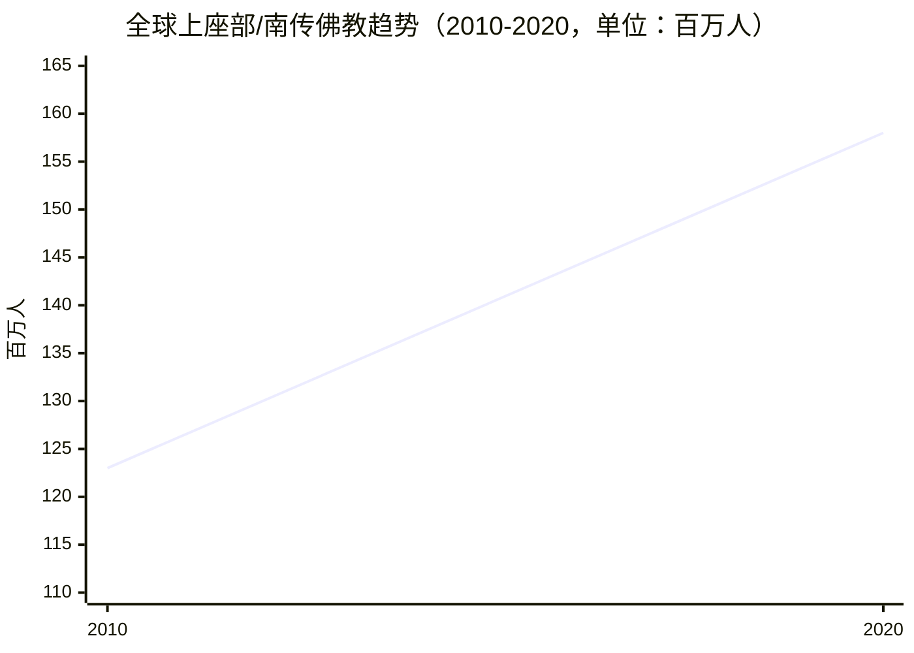
```mermaid
xychart-beta
    title "全球上座部/南传佛教趋势（2010-2020，单位：百万人）"
    x-axis [2010, 2020]
    y-axis "百万人" 110 --> 165
    line [123, 158]
```

四者叠加图：

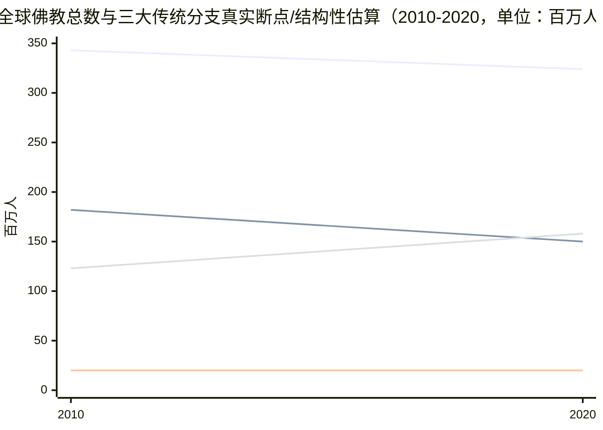
```mermaid
xychart-beta
    title "全球佛教总数与三大传统分支真实断点/结构性估算（2010-2020，单位：百万人）"
    x-axis [2010, 2020]
    y-axis "百万人" 0 --> 350
    line "全球总数" [343, 324]
    line "汉传/东亚大乘" [182, 150]
    line "藏传/金刚乘" [20, 20]
    line "上座部/南传" [123, 158]
```

由于上图中“全球总数”和“汉传/东亚大乘”量级远大于藏传，下面单独放大三大传统：

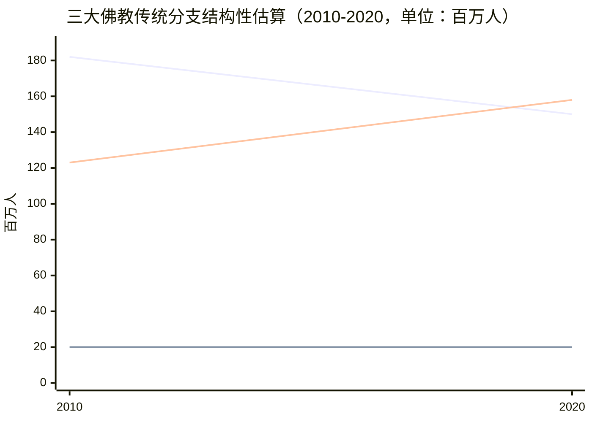
```mermaid
xychart-beta
    title "三大佛教传统分支结构性估算（2010-2020，单位：百万人）"
    x-axis [2010, 2020]
    y-axis "百万人" 0 --> 190
    line "汉传/东亚大乘" [182, 150]
    line "藏传/金刚乘" [20, 20]
    line "上座部/南传" [123, 158]
```

**分支趋势总结：** 全球佛教下降主要来自汉传/东亚大乘身份流失；上座部由于东南亚人口基本盘和印度/西方内观影响而相对上升；藏传/金刚乘的公开信众数据最不稳定，但其制度和文化黏性很强，不能简单按东亚大乘的下降模型处理。

### 三大传统在大洲区域的分布

|大洲/区域|汉传/东亚大乘|藏传/金刚乘|上座部/南传|核心说明|
|---|---:|---:|---:|---|
|亚太地区|约 1.40 亿-1.50 亿|约 1,500 万-2,000 万|约 1.50 亿以上|全球三大传统的主体都在亚太；汉传下降、上座部稳定/上升。|
|北美洲|约 350 万-420 万|约 30 万-60 万|约 70 万-100 万|华人、越南裔、日裔、韩裔构成大乘主体；藏传中心和内观/上座部也很活跃。|
|欧洲|约 150 万-190 万|约 30 万-50 万|约 50 万-75 万|越南/华人/日系大乘、藏传中心、泰国/斯里兰卡上座部并存。|
|大洋洲|约 40 万上下|约数万|约 20 万-25 万|澳大利亚和新西兰因东南亚移民，上座部比例高于北美和欧洲。|
|拉丁美洲|约 40 万上下|少量|极少|日裔佛教和日本大乘传统占主导，尤其是巴西。|
|非洲|约 8 万-10 万|极少|约 15 万上下|规模很小，南非华人/台湾佛教组织和毛里求斯/南亚上座部社群较突出。|

图例：

|曲线|代表对象|
|---|---|
|汉传/东亚大乘|各大洲东亚大乘、华人/越南/日本/韩国佛教社群估算|
|藏传/金刚乘|各大洲藏传佛教、蒙古/喜马拉雅/俄罗斯佛教和海外藏传中心估算|
|上座部/南传|各大洲东南亚、斯里兰卡、云南南传和内观/上座部社群估算|

横轴编号：

|编号|大洲/区域|
|---:|---|
|1|亚太|
|2|北美|
|3|欧洲|
|4|大洋洲|
|5|拉美|
|6|非洲|

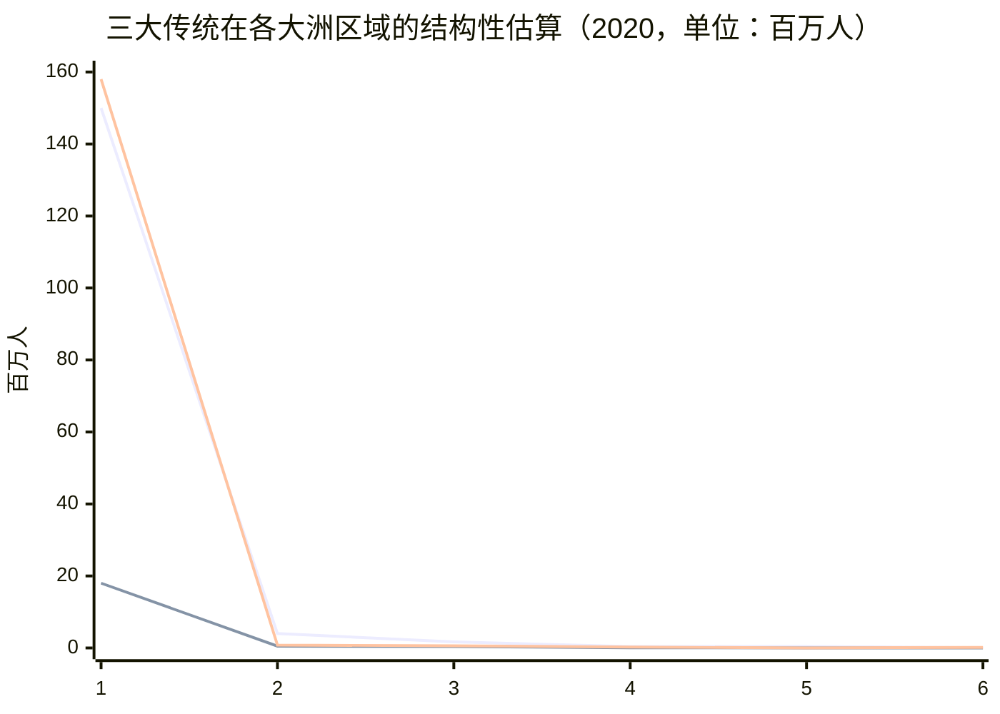
```mermaid
xychart-beta
    title "三大传统在各大洲区域的结构性估算（2020，单位：百万人）"
    x-axis [1, 2, 3, 4, 5, 6]
    y-axis "百万人" 0 --> 160
    line "汉传/东亚大乘" [150, 4.0, 1.7, 0.4, 0.4, 0.1]
    line "藏传/金刚乘" [18, 0.5, 0.4, 0.03, 0.02, 0.01]
    line "上座部/南传" [158, 0.8, 0.6, 0.23, 0.02, 0.15]
```

### 三大传统在主要国家/地区的分布

|国家/地区|汉传/东亚大乘|藏传/金刚乘|上座部/南传|说明|
|---|---:|---:|---:|---|
|中国大陆|正式身份约 5,338 万；广义佛菩萨信仰可达 3.62 亿成年人|藏区/蒙古族地区约千万级文化圈，信众精确数不足|云南南传约 150 万-180 万|中国最难统计；正式身份低，文化实践广。|
|台湾|约 490 万-800 万|少量藏传中心|约 18 万-25 万|大乘组织化强，南传主要在移工和禅修圈。|
|日本|约 4,699 万|极少|极少|大乘净土、禅、日莲、真言等为主体。|
|韩国|约 985 万|极少|极少|曹溪宗等禅宗/大乘传统为主体。|
|越南|约 2,100 万上下|极少|约百万级高棉族等南传群体|京族主流为大乘/禅净融合。|
|泰国|少量华裔大乘|极少|约 6,762 万|全球最大正式佛教国家，上座部主体。|
|缅甸|少量华人/其他传统|少量|约 4,721 万|上座部主体。|
|斯里兰卡|极少|极少|约 1,570 万|上座部主体。|
|柬埔寨|极少|极少|约 1,624 万|上座部占比极高。|
|老挝|极少|极少|约 640 万|上座部主体。|
|印度|少量大乘/喜马拉雅传统|拉达克、锡金、阿鲁纳恰尔等喜马拉雅地区|Navayana 与上座部资源相关，但不能完全等同|2011 官方佛教徒 844 万，2020 Pew 估 955 万。|
|蒙古/不丹/俄罗斯佛教区|少量|藏传/金刚乘为主体|极少|藏传在这些区域有民族宗教属性。|
|美国/加拿大|华人、越南裔、日裔、韩裔大乘为主体|藏传中心活跃|泰国、斯里兰卡、缅甸、内观社群|移民佛教和本土皈依并存。|
|英国/法国/德国|越南、华人、日本禅等大乘|藏传中心活跃|泰国、斯里兰卡、柬埔寨、老挝社群和内观圈|欧洲三大传统并存，但无官方宗派普查。|
|澳大利亚/新西兰|华人、越南等大乘|少量藏传中心|泰国、斯里兰卡、缅甸等上座部较强|大洋洲上座部占比高于欧美平均。|

图例：

|曲线|代表对象|
|---|---|
|汉传/东亚大乘|主要国家/地区内东亚大乘传统估算|
|藏传/金刚乘|主要国家/地区内藏传/金刚乘传统估算|
|上座部/南传|主要国家/地区内上座部/南传传统估算|

横轴编号：

|编号|国家/地区|
|---:|---|
|1|中国大陆|
|2|日本|
|3|越南|
|4|韩国|
|5|台湾|
|6|泰国|
|7|缅甸|
|8|柬埔寨|
|9|斯里兰卡|
|10|老挝|
|11|印度|

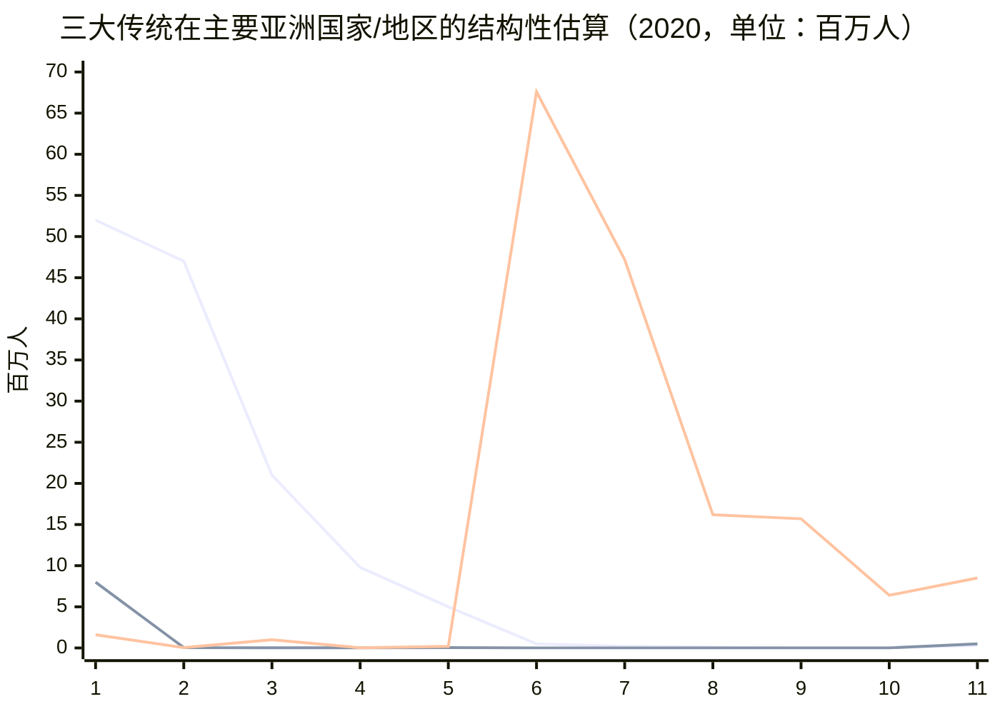
```mermaid
xychart-beta
    title "三大传统在主要亚洲国家/地区的结构性估算（2020，单位：百万人）"
    x-axis [1, 2, 3, 4, 5, 6, 7, 8, 9, 10, 11]
    y-axis "百万人" 0 --> 70
    line "汉传/东亚大乘" [52, 47, 21, 9.8, 5, 0.5, 0.2, 0.1, 0.05, 0.05, 0.3]
    line "藏传/金刚乘" [8, 0.05, 0.02, 0.02, 0.05, 0.01, 0.01, 0.01, 0.01, 0.01, 0.5]
    line "上座部/南传" [1.6, 0.05, 1.0, 0.02, 0.2, 67.6, 47.2, 16.2, 15.7, 6.4, 8.5]
```

### 三大传统在主要欧洲国家的分布

欧洲国家没有官方宗派普查，下列数字是根据总佛教徒规模、移民来源、寺院网络和佛教联盟资料做的结构性估算。

|国家|汉传/东亚大乘|藏传/金刚乘|上座部/南传|说明|
|---|---:|---:|---:|---|
|英国|约 16 万-18 万|约 2 万-4 万|约 9 万-11 万|华人、越南裔和日本禅构成大乘主体；泰国/斯里兰卡与森林僧团支撑上座部。|
|法国|约 30 万-35 万|约 5 万-8 万|约 10 万-12 万|越南大乘、梅村传统、藏传中心和柬埔寨/老挝上座部并存。|
|德国|约 18 万-22 万|约 4 万-6 万|约 6 万-8 万|越南大乘、藏传中心、泰国/斯里兰卡社群和内观圈并存。|
|瑞典|约 1 万-2 万|约数千|约 3 万-4 万|泰国移民使上座部比例较高。|
|挪威|约 1 万-1.6 万|约数千|约 1.5 万-2.5 万|越南大乘与泰国/斯里兰卡上座部并存。|
|俄罗斯佛教区|极少|约 90 万-150 万|极少|卡尔梅克、布里亚特、图瓦等原生藏传/金刚乘区域。|

图例：

|曲线|代表对象|
|---|---|
|汉传/东亚大乘|欧洲国家内东亚大乘传统估算|
|藏传/金刚乘|欧洲国家内藏传/金刚乘传统估算|
|上座部/南传|欧洲国家内上座部/南传传统估算|

横轴编号：

|编号|国家|
|---:|---|
|1|英国|
|2|法国|
|3|德国|
|4|瑞典|
|5|挪威|
|6|俄罗斯佛教区|

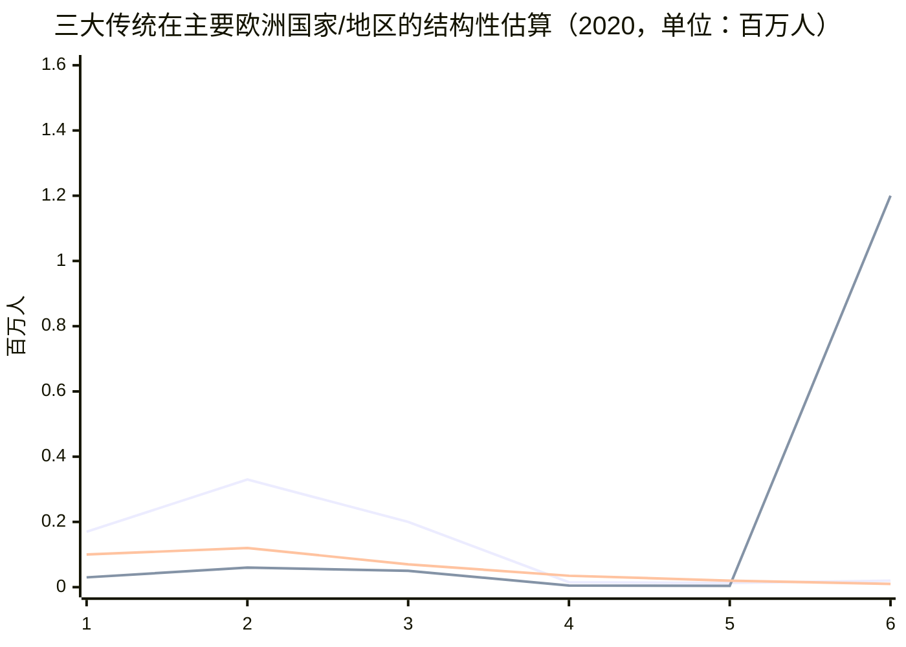
```mermaid
xychart-beta
    title "三大传统在主要欧洲国家/地区的结构性估算（2020，单位：百万人）"
    x-axis [1, 2, 3, 4, 5, 6]
    y-axis "百万人" 0 --> 1.6
    line "汉传/东亚大乘" [0.17, 0.33, 0.20, 0.015, 0.013, 0.02]
    line "藏传/金刚乘" [0.03, 0.06, 0.05, 0.005, 0.004, 1.2]
    line "上座部/南传" [0.10, 0.12, 0.07, 0.035, 0.02, 0.01]
```

### 三大传统在主要美洲国家的分布

|国家/地区|汉传/东亚大乘|藏传/金刚乘|上座部/南传|说明|
|---|---:|---:|---:|---|
|美国|约 290 万-340 万|约 30 万-50 万|约 70 万-80 万|华人、越南裔、日裔、韩裔为大乘主体；藏传中心和内观/上座部也显著。|
|加拿大|约 31 万-40 万|约 3 万-5 万|约 5 万|华人、越南裔、柬埔寨裔、斯里兰卡裔社群构成主体。|
|巴西|约 25 万-30 万|少量|极少|日本移民后裔和本土化日本佛教占主体。|
|墨西哥/中美|约数万|少量|少量|总体规模小，以城市禅修中心和亚洲移民社群为主。|
|阿根廷/智利等南美国家|约数万|少量|少量|日裔、华人和现代禅修中心构成小规模基本盘。|

图例：

|曲线|代表对象|
|---|---|
|汉传/东亚大乘|美洲国家内东亚大乘传统估算|
|藏传/金刚乘|美洲国家内藏传/金刚乘传统估算|
|上座部/南传|美洲国家内上座部/南传传统估算|

横轴编号：

|编号|国家/地区|
|---:|---|
|1|美国|
|2|加拿大|
|3|巴西|
|4|墨西哥/中美|
|5|阿根廷/智利等南美国家|

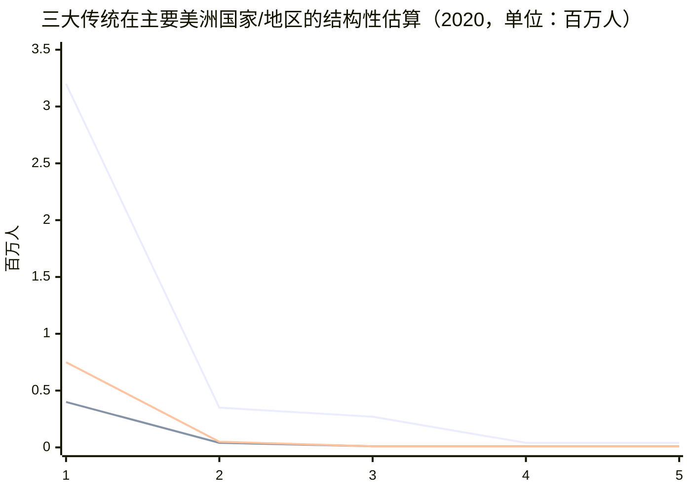
```mermaid
xychart-beta
    title "三大传统在主要美洲国家/地区的结构性估算（2020，单位：百万人）"
    x-axis [1, 2, 3, 4, 5]
    y-axis "百万人" 0 --> 3.5
    line "汉传/东亚大乘" [3.2, 0.35, 0.27, 0.04, 0.04]
    line "藏传/金刚乘" [0.40, 0.04, 0.01, 0.01, 0.01]
    line "上座部/南传" [0.75, 0.05, 0.01, 0.01, 0.01]
```

### 三大传统在其他主要地区国家的分布

这里的“其他地区”主要覆盖大洋洲、非洲和部分非东亚/非东南亚佛教区域。

|国家/地区|汉传/东亚大乘|藏传/金刚乘|上座部/南传|说明|
|---|---:|---:|---:|---|
|澳大利亚|约 39 万|约数万|约 22 万|华人/越南大乘与泰国/斯里兰卡上座部并存。|
|新西兰|约 3.5 万|少量|约 1.8 万|奥克兰亚洲移民和本土禅修圈为主体。|
|南非|约数万|少量|约十万级以内|华人佛教组织和南亚/斯里兰卡社群并存。|
|毛里求斯|少量|极少|约数万|南亚、斯里兰卡相关上座部社群更明显。|
|蒙古/不丹/尼泊尔喜马拉雅区|少量|约数百万|少量|藏传/金刚乘主体区域。|

图例：

|曲线|代表对象|
|---|---|
|汉传/东亚大乘|其他地区国家内东亚大乘传统估算|
|藏传/金刚乘|其他地区国家内藏传/金刚乘传统估算|
|上座部/南传|其他地区国家内上座部/南传传统估算|

横轴编号：

|编号|国家/地区|
|---:|---|
|1|澳大利亚|
|2|新西兰|
|3|南非|
|4|毛里求斯|
|5|蒙古/不丹/尼泊尔喜马拉雅区|

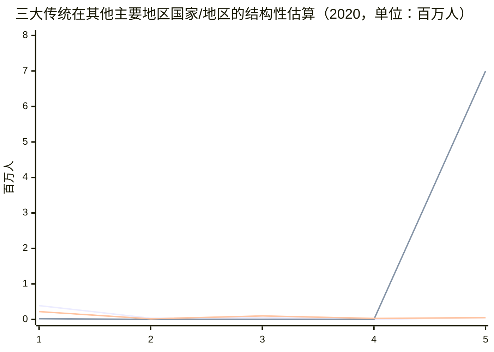
```mermaid
xychart-beta
    title "三大传统在其他主要地区国家/地区的结构性估算（2020，单位：百万人）"
    x-axis [1, 2, 3, 4, 5]
    y-axis "百万人" 0 --> 8
    line "汉传/东亚大乘" [0.39, 0.035, 0.05, 0.005, 0.05]
    line "藏传/金刚乘" [0.02, 0.003, 0.005, 0.001, 7.0]
    line "上座部/南传" [0.22, 0.018, 0.10, 0.03, 0.05]
```

### 传统分支数据可信度

|数据类型|可信度|使用方式|
|---|---|---|
|Pew 2010/2020 国家佛教徒总数|高|可作为国家/大洲总趋势主轴|
|各国普查中的佛教身份|高|可作国家断点趋势，如英国、澳大利亚、新西兰、印度|
|全球三大传统比例：东亚大乘 53%、上座部 36%、藏传/金刚乘 6%|中|适合做 2010 年结构性基准，不适合精确到国家内部|
|2020 年按国家传统归属拆分|中低|适合做结构图，需标注估算|
|中国汉传/藏传/南传信徒人数|低到中|只能用身份、信仰、寺院、僧尼、区域民族数据拼合，不应写成精确普查|

### 国家/地区历史发展数据

不同国家的历史数据不能强行放在同一条曲线上。英国、加拿大、澳大利亚、新西兰、印度、巴西等有官方普查断点；中国、日本、台湾等地则因为“宗教身份、文化信仰、寺院登记、民间实践”口径差异大，只能做多口径趋势判断。下面的折线图只画真实断点，能追溯到哪个公开统计断点，就从哪个断点开始。

|国家/地区|历史数据点|趋势判断|
|---|---|---|
|中国大陆|2018 CGSS 正式佛教身份约 4,200 万成年人；2018 CFPS 相信佛/菩萨约 3.62 亿成年人；Pew 2025 估计 2020 正式身份约 5,338 万。[1][3]|正式身份低，文化实践广。历史变化不能只看“佛教徒”一项，必须同时看身份、信仰、寺庙实践和民间宗教。|
|泰国|Pew 2025 估计 2020 年约 6,762 万佛教徒，占 94.4%。[1]|传统上座部核心国，仍是正式身份口径下全球最大佛教国家；未来压力来自少子化和城市世俗化。|
|缅甸|Pew 2025 估计 2020 年约 4,721 万佛教徒，占 89.1%。[1]|上座部基本盘强，但政治动荡影响寺院、教育和社会供养结构。|
|日本|Pew 2025 估计 2020 年约 4,699 万佛教徒，占 37.2%；2010-2020 年约减少 700 万。[1]|东亚佛教正式身份下降的典型案例；寺檀制度老化、乡村寺院衰退和无宗教身份上升并行。|
|韩国|Pew 2025 估计 2020 年约 985 万佛教徒，占 19.0%。[1]|曹溪宗等大乘/禅宗传统仍重要，但年轻世代宗教身份下降明显。|
|越南|Pew 2025 估计 2020 年约 2,258 万佛教徒，占 23.0%。[1]|正式佛教身份、民间信仰和祖先祭祀高度重叠，海外越南佛教网络比国内正式数据更容易被看见。|
|柬埔寨|Pew 2025 估计 2020 年约 1,624 万佛教徒，占 97.1%。[1]|上座部与民族文化和乡村社会高度绑定，是全球佛教比例最高地区之一。|
|斯里兰卡|Pew 2025 估计 2020 年约 1,570 万佛教徒，占 69.6%。[1]|上座部传统强，僧伽政治影响力高；经济危机会影响供养和寺院社会功能。|
|印度|2011 官方普查佛教徒 8,442,972；Pew 2025 估计 2020 年约 955 万。[1][15]|达利特新佛教推动增长，但 Navayana 不应简单等同东南亚上座部。|
|台湾|政府/宗教组织旧统计曾给佛教约 800 万；近年国际宗教自由报告常见约 19%-20% 自认佛教，约 490 万量级。[16]|大乘组织现代化很强，但正式身份、民间信仰和宫庙文化口径差异大。南传主要通过移工、新住民、译经和禅修圈扩散。|
|英国|英格兰和威尔士佛教徒：2001 年约 144,453；2011 年约 247,743；2021 年 272,508；加上苏格兰、北爱后英国 2021 约 289,551。[6]|2001-2011 增长快，2011-2021 增速放缓；移民佛教和本土禅修并行。|
|加拿大|2021 普查 356,975 人，约 1%；2001 年比例也约 1%，中间有移民结构变化。[7]|总比例稳定，但内部族群和城市分布变化明显，多伦多、温哥华等都市圈重要。|
|澳大利亚|1996 约 20 万；2001 约 36 万；2006 约 42 万；2011 约 53 万；2016 约 56 万；2021 约 61.6 万。[8]|亚洲移民推动长期增长；上座部比例高于北美和欧洲平均。|
|新西兰|1991 约 12,762；1996 约 28,131；2001 约 41,661；2006 约 52,392；2013 约 58,440；2018 约 52,779；2023 约 57,135。[9]|长期上升后在 2018 有回落，2023 又回升；亚洲移民和奥克兰都市圈很关键。|
|巴西|2010 普查接近 25 万；常见估计约 25 万-30 万。[18]|以日本移民后裔和本土化日本佛教为主体；缺少高频历史序列。|

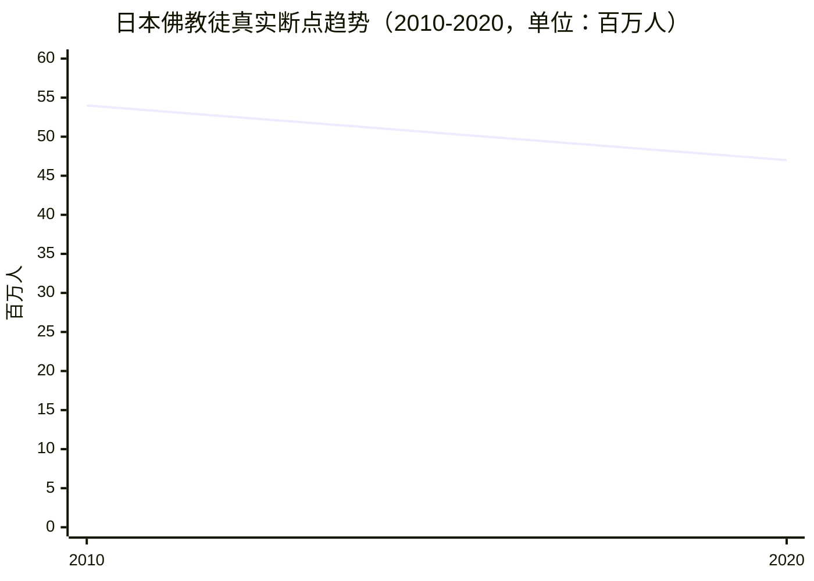
```mermaid
xychart-beta
    title "日本佛教徒真实断点趋势（2010-2020，单位：百万人）"
    x-axis [2010, 2020]
    y-axis "百万人" 0 --> 60
    line [54.0, 47.0]
```

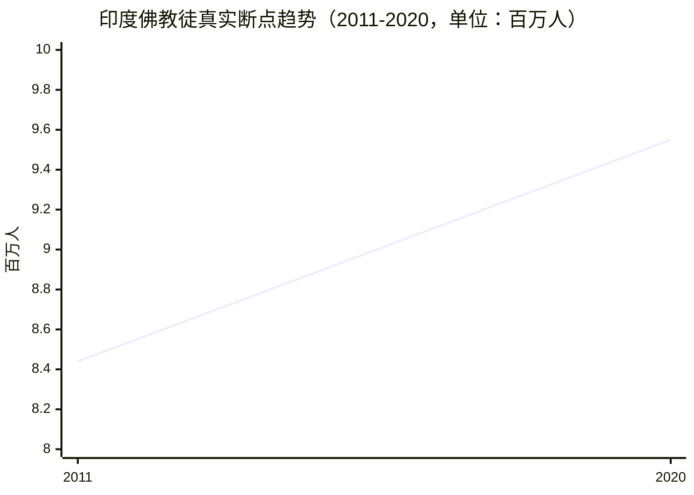
```mermaid
xychart-beta
    title "印度佛教徒真实断点趋势（2011-2020，单位：百万人）"
    x-axis [2011, 2020]
    y-axis "百万人" 8 --> 10
    line [8.44, 9.55]
```

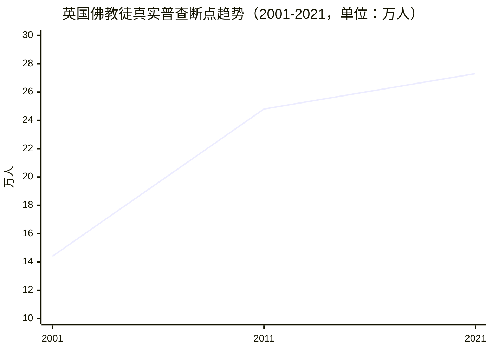
```mermaid
xychart-beta
    title "英国佛教徒真实普查断点趋势（2001-2021，单位：万人）"
    x-axis [2001, 2011, 2021]
    y-axis "万人" 10 --> 30
    line [14.4, 24.8, 27.3]
```

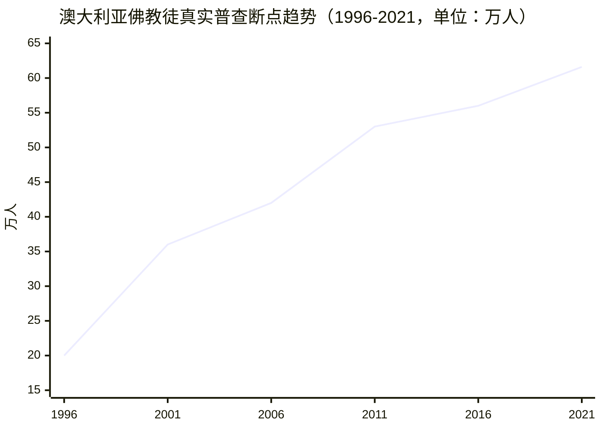
```mermaid
xychart-beta
    title "澳大利亚佛教徒真实普查断点趋势（1996-2021，单位：万人）"
    x-axis [1996, 2001, 2006, 2011, 2016, 2021]
    y-axis "万人" 15 --> 65
    line [20, 36, 42, 53, 56, 61.6]
```

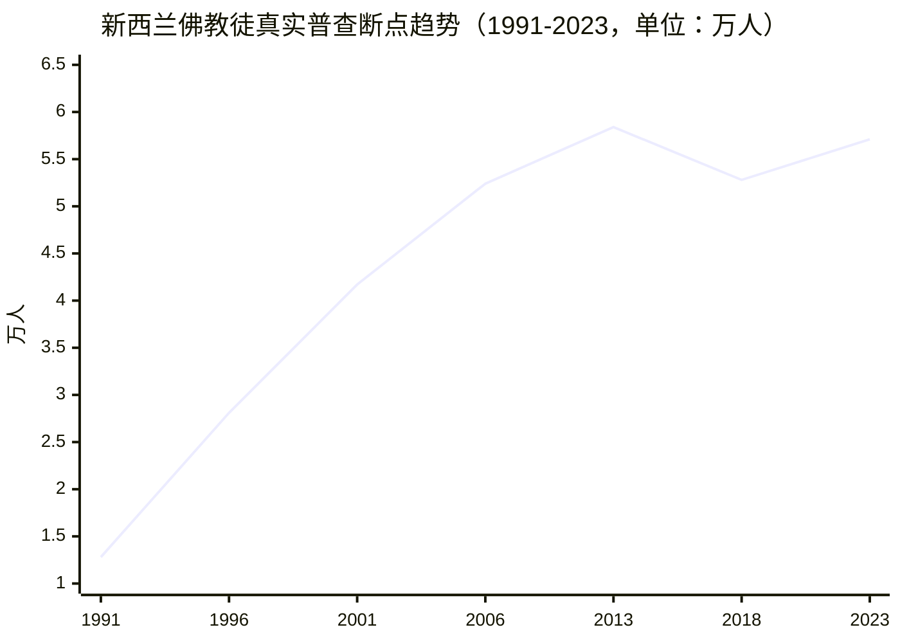
```mermaid
xychart-beta
    title "新西兰佛教徒真实普查断点趋势（1991-2023，单位：万人）"
    x-axis [1991, 1996, 2001, 2006, 2013, 2018, 2023]
    y-axis "万人" 1 --> 6.5
    line [1.28, 2.81, 4.17, 5.24, 5.84, 5.28, 5.71]
```

**国家/地区趋势总结：** 东亚传统大乘区的主要问题是正式身份下降，不是佛教文化完全消失；东南亚上座部国家仍维持高比例，但长期要看少子化；英语国家和大洋洲的增长主要来自亚洲移民和本土禅修；印度新佛教是一个独立变量，应和传统上座部、汉传大乘、藏传分开讨论。

---

## 中国佛教：人数最多，也最难统计

中国是理解全球佛教趋势的关键，因为中国的统计口径差异极大。

Pew 2023 年关于中国宗教测量的报告指出，中国佛教徒比例可以从 4% 到 33% 不等，取决于采用哪种问题。[3]

|统计口径|估算人数|占比|含义|
|---|---:|---:|---|
|正式佛教身份|约 4200 万成年人|约 4%|2018 CGSS 中正式认同佛教身份的人|
|相信佛/菩萨|约 3.62 亿成年人|约 33%|2018 CFPS 中表示相信佛或菩萨的人；可能同时相信其他神灵|
|只相信佛/菩萨、不选其他神灵|低于 3.62 亿|约 16%|更接近专一佛教信仰，但仍非正式宗教身份|
|官方/行业估计|常见说法约 1 亿上下|约 7%-9%|通常来自寺院、香客、协会和经验估算，缺少统一统计方法|

这说明中国佛教不是“少”，而是“身份认同低、文化实践广”。很多人既拜佛，又祭祖、拜财神、相信风水或参与民间信仰。严格问“你的宗教是什么”，他们可能回答“无宗教”；问“你相信佛或菩萨吗”，比例就会显著上升。

### 中国佛教内部结构

中国佛教至少应分为四个部分看：

|类型|主要人群|趋势|
|---|---|---|
|汉传大乘|汉族地区寺院、居士、香客、佛教文化参与者|绝对影响力大，但正式身份承压；年轻人中出现寺庙游、烧香热、禅修热|
|藏传佛教|西藏、青海、四川、甘肃、云南等藏族地区，以及部分蒙古族地区|民族文化黏性强，不能简单归入汉地世俗化模型|
|云南南传佛教|傣族、布朗族、德昂族、阿昌族等边疆民族|区域性强，与东南亚上座部文化圈相连|
|汉地都市南传|北上广深、成都、杭州等地的高知居士、禅修者、翻译圈|公开统计极少，规模只能粗估；影响力主要在网络、翻译、禅修圈|

### 中国三大佛教传统的可视化限制

中国佛教内部的汉传、藏传、南传上座部，公开资料中很少有“信徒人数 + 宗派归属 + 连续年份”的统计。可核对的数据通常分成三类：一是 Pew/CGSS/CFPS 的“佛教身份或佛菩萨信仰”总量，但不细分宗派；二是政府和宗教事务资料中的寺院、僧尼、活动场所数量，但它们反映制度规模，不等于信徒人数；三是地方民族宗教研究中的区域估算，例如云南南传佛教量级。

因此，下面三张图不是同一种指标，不能相加：

1. 汉传佛教：只能用“中国正式佛教身份总量”近似观察汉传主体趋势，因为中国正式佛教徒绝大多数属于汉传文化圈，但这个图不等于严格的汉传佛教徒人数。
2. 藏传佛教：较可靠的是寺院/僧尼等制度规模断点，尤其是西藏自治区和藏区资料；它不等于藏传佛教信众总人数。
3. 南传上座部：较可靠的是云南佛教/南传民族区域量级，公开连续年份很少，只能做断点或区间图。

|分支|可用指标|已知断点/量级|能否画信徒折线|说明|
|---|---|---|---|---|
|汉传佛教|中国正式佛教身份总量；相信佛/菩萨总量|2018 CGSS 正式身份约 4,200 万成年人；2018 CFPS 相信佛/菩萨约 3.62 亿成年人；Pew 2020 正式身份约 5,338 万。[1][3]|不能画严格宗派信徒折线|中国佛教身份主体大概率以汉传为主，但数据源不直接问“汉传/藏传/南传”。|
|藏传佛教|寺院、僧尼、活动场所；藏族地区宗教文化参与|西藏自治区常见官方断点为约 1,700 多处藏传佛教活动场所、约 4.6 万住寺僧尼；更广义藏区资料常见约 3,000 座藏传佛教寺院、约 12 万僧尼。[21]|不能画信众折线；可画制度规模断点图|藏传佛教与民族文化绑定强，信众规模不宜简单用寺院/僧尼反推。|
|云南南传上座部|云南佛教信众、合法佛教场所、南传民族区域估算|云南可统计佛教信徒常见说法约 256 万余人；其中南传上座部主要分布在傣族、布朗族、德昂族、阿昌族等民族中，常见估算约 150 万-180 万。[21]|不能画连续信徒折线；可画量级区间图|云南数据包含汉传、藏传和南传，南传部分多是民族/区域估算。|

图例：

|曲线|代表对象|
|---|---|
|正式佛教身份|在调查中正式回答“佛教”的中国成年人/人口估计|
|相信佛/菩萨|在调查中表示相信佛或菩萨的中国成年人|

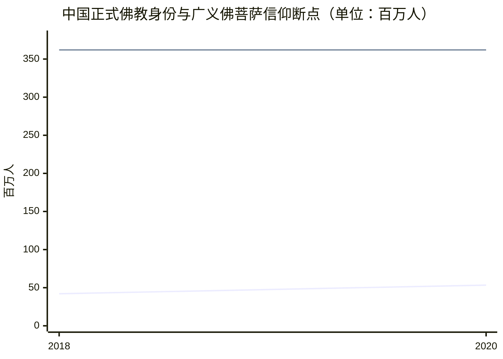
```mermaid
xychart-beta
    title "中国正式佛教身份与广义佛菩萨信仰断点（单位：百万人）"
    x-axis [2018, 2020]
    y-axis "百万人" 0 --> 380
    line "正式佛教身份" [42, 53.38]
    line "相信佛/菩萨" [362, 362]
```

这张图显示的是“总佛教身份/佛菩萨信仰”，不是汉传佛教专门统计。因为汉传佛教是中国佛教主体，它可以作为观察汉传文化圈的近似背景，但不能写成“汉传佛教徒精确人数”。

图例：

|曲线|代表对象|
|---|---|
|西藏自治区住寺僧尼|西藏自治区藏传佛教住寺僧尼制度规模|
|广义藏区僧尼|西藏、青海、四川、甘肃、云南等藏区藏传佛教僧尼制度规模估计|

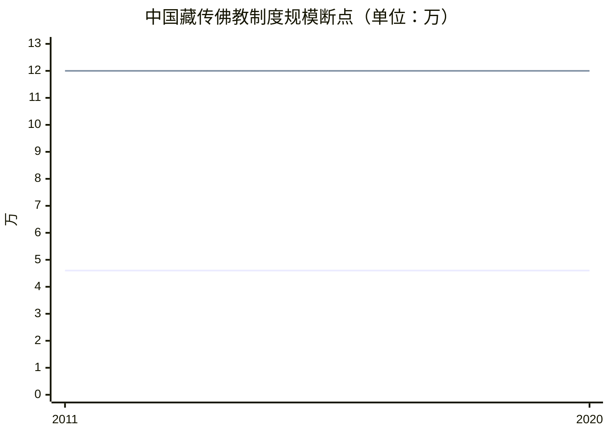
```mermaid
xychart-beta
    title "中国藏传佛教制度规模断点（单位：万）"
    x-axis [2011, 2020]
    y-axis "万" 0 --> 13
    line "西藏自治区住寺僧尼" [4.6, 4.6]
    line "广义藏区僧尼" [12, 12]
```

这张图用的是公开资料反复出现的制度规模量级。它说明藏传佛教僧伽和寺院体系规模很高，但不代表藏传佛教信众人数没有变化；公开资料不足以支持更细的年度或十年信众曲线。

图例：

|曲线|代表对象|
|---|---|
|云南可统计佛教信徒|云南省可统计佛教信徒总量，包含汉传、藏传、南传|
|云南南传上座部估算下限|云南南传上座部信徒常见估算的保守下限|
|云南南传上座部估算上限|云南南传上座部信徒常见估算的上限|

```mermaid
xychart-beta
    title "云南佛教与南传上座部量级断点（单位：百万人）"
    x-axis [2020]
    y-axis "百万人" 0 --> 3
    line "云南可统计佛教信徒" [2.56]
    line "云南南传上座部估算下限" [1.5]
    line "云南南传上座部估算上限" [1.8]
```

南传上座部在中国主要是云南边疆民族佛教。它的文化边界清楚，但公开统计断点少，所以这里保留为“量级图”，不伪装成历史折线。

### 汉地南传信徒应谨慎表述

“汉地南传信徒 10 万至 20 万”这类数字目前缺少可靠公开统计。可以作为观察性估计，但不宜写成确数。更稳妥的说法是：

> 云南以外的汉地城市中，存在一个活跃的上座部/早期佛教修学群体，主要通过巴利经典翻译、线上读书会、内观禅修、赴泰缅斯里兰卡短期修学和城市禅修中心形成网络。其公开可验证的人口规模有限，但在中文佛教知识生产和年轻高知禅修圈中影响明显。

---

## 西藏与藏传佛教：不能简单套用全球下降模型

西藏自治区和周边藏族地区的佛教情况，与汉地佛教明显不同。藏传佛教不仅是宗教身份，也是语言、节日、家庭礼仪、地方秩序和民族文化的一部分。

需要谨慎处理三个问题：

1. “几乎全民信仰”可以作为文化描述，但具体比例应避免写得过满。西藏和藏区还存在苯教、伊斯兰教、天主教、无明确宗教身份者，以及不同程度的文化佛教参与者。
2. 西藏自治区内寺院、僧尼、活动场所数据可以引用政府或国际宗教自由报告，但这些来源有政治立场差异，最好并列使用。
3. 藏传佛教向汉地和西方传播确实存在，但公开统计不足；更稳妥的表述是“影响力显著，精确人口规模仍缺少可靠调查”。

比较稳妥的结论是：藏传佛教区域的宗教身份与民族文化绑定更深，因此不太适合用“东亚城市世俗化导致佛教身份下降”这个单一模型解释。但人口、政策、教育、城市化和跨区域流动仍会改变其未来形态。

---

## 上座部佛教：稳定基本盘与“技术出海”

上座部佛教的核心地区是泰国、缅甸、斯里兰卡、柬埔寨和老挝。它的全球人数超过 1 亿是可信的；如果把东南亚五国、斯里兰卡、印度新佛教和海外移民都纳入，规模大概率在 1.5 亿以上。但“占全球佛教 30%-35%”属于估算，不能当作各国普查直接结论。

### 核心国家

|国家|佛教徒/上座部规模的稳妥说法|趋势判断|
|---|---|---|
|泰国|Pew 2025 估计约 6800 万佛教徒，占约 94%|仍是全球最大正式佛教国家，但少子化会影响长期增长|
|缅甸|佛教徒约接近九成，全国多数为上座部|人口基础仍大，但政治动荡影响寺院和社会结构|
|斯里兰卡|约七成人口为佛教徒，多为上座部|文化黏性强，但经济和政治危机会影响僧伽社会角色|
|柬埔寨|约 97% 为佛教徒|比例极高，人口增长仍支撑佛教基本盘|
|老挝|约六成以上为佛教徒|与乡村社会和节庆深度绑定，随总人口温和变化|

### 印度新佛教：不要简单归为“完全上座部”

印度佛教增长主要与 B. R. Ambedkar 发起的新佛教运动有关。很多达利特群体通过皈依佛教表达对种姓制度的拒绝。印度官方普查中的佛教徒约千万级，民间组织有更高估计。

但应避免说“这派佛教完全遵循上座部传统”。更准确的说法是：

> 印度新佛教大量使用巴利佛教、早期佛教和社会解放思想资源，与上座部传统有重要关系，但通常也被称为 Navayana 或 Ambedkarite Buddhism，不能简单等同于传统东南亚上座部。

### 正念、内观与上座部影响力

内观禅修、四念处、安般念、MBSR 正念减压等现代修行技术，确实让上座部相关传统在全球产生了远超寺院人口的影响。但这里必须区分三层：

1. 正式皈依上座部佛教的人。
2. 参加内观、森林禅、巴利经典学习，但不一定登记宗教身份的人。
3. 参加正念课程、心理治疗或企业培训，但完全不认为自己是佛教徒的人。

第三类增长最明显，但它是佛教技术的世俗化扩散，不等于佛教徒人口增长。

---

## 欧洲佛教：移民寺庙与本土禅修并行

Pew 2025 估计，欧洲佛教徒从 2010 到 2020 年增长约 26%，到 2020 年约 250 万人。[1] 这说明欧洲佛教整体不是衰退，而是小基数增长。

欧洲佛教主要由两条线构成：

1. 移民社群线：泰国、斯里兰卡、柬埔寨、老挝、越南、中国、日本、韩国等移民建立寺庙、文化中心和节庆网络。
2. 本土修行线：英国森林僧团、德国和法国的禅修中心、藏传佛教中心、日本禅宗、内观和正念课程吸引欧洲本土知识阶层。

### 欧洲主要国家与宗派估算

欧洲国家通常有“宗教身份”或“宗教团体注册”数据，但很少有官方数据细分到上座部、大乘、金刚乘。因此，佛教徒总数可以相对确定；宗派拆分只能作为结构性估算，依据是移民来源、寺院网络、佛教联盟资料和学术研究。

|国家|佛教徒总数|上座部相关估算|大乘/金刚乘相关估算|可信度与说明|
|---|---:|---:|---:|---|
|英国|约 289,551 人|约 10 万上下|约 18 万上下|总数来自 2021 英国各地区普查汇总：英格兰和威尔士 272,508，苏格兰 15,501，北爱 1,542。[6] 宗派拆分不是官方普查，主要根据泰国/斯里兰卡移民、英国森林僧团、华人/越南大乘和藏传中心估算。|
|法国|约 40 万-50 万；部分佛教组织和媒体会给出最高约 100 万的广义文化/禅修估计|约 10 万-12 万|约 30 万-38 万|法国没有稳定官方宗教普查。UBF/相关资料常用约 40 万量级，广义估计可更高。[11] 上座部主要来自柬埔寨、老挝、泰国、斯里兰卡社群和内观圈；大乘/金刚乘包括越南大乘、华人、日本禅、藏传与梅村传统。|
|德国|约 27 万-30 万|约 6 万-8 万|约 20 万-23 万|REMID/DBU 相关资料常用约 27 万-30 万量级，且指出亚洲裔佛教徒很多不在 DBU 组织内。[12] “上座部 7.5 万”可保留为估算，主要来自泰国、斯里兰卡、缅甸/东南亚移民和内观圈；不要写成官方统计。|
|瑞典|注册佛教团体成员约 12,328；实际佛教徒估计约 57,000|约 3 万-4 万|约 1.5 万-2.5 万|瑞典官方支持宗教团体统计只覆盖登记成员；研究和宗教事务资料估计实际佛教徒约 57,000。[13] 泰国、越南、中国等亚洲移民构成主体；上座部比例较高，但具体宗派数仍是估算。|
|挪威|注册/活跃会员约 2 万多；广义估计约 3 万-5 万|约 1.5 万-2.5 万|约 1 万-2 万|挪威佛教联合会属于可引用组织来源，广义人口常估 30,000-50,000。[14] 越南大乘、泰国/斯里兰卡上座部、藏传和本土皈依群体并存。|
|五国小计|约 105 万-120 万|约 30 万-37 万|约 70 万-84 万|这是表内五国小计，不等于全欧洲。Pew 2025 的全欧洲佛教徒约 250 万，其他欧洲国家和俄罗斯佛教传统另需单列。|

欧洲的核心结论不是“上座部取代大乘”，而是“双轨并行”：移民寺庙维持宗教共同体，本土禅修与正念扩大文化影响力。英国相对特殊，因为泰系森林僧团、本土出家制度和巴利经典研究较成熟；德国和法国则更明显呈现“组织佛教 + 世俗化禅修”的双层结构。

---

## 亚洲主要地区：总表

以下表格尽量保留具体数字。总佛教徒数优先采用 Pew 2025、各地官方普查或政府资料；宗派拆分在多数地方没有官方统计，因此以“估算/结构判断”标注。

|地区/国家|佛教徒总数|上座部/南传|大乘/金刚乘/其他|核心结构与趋势|
|---|---:|---:|---:|---|
|中国大陆|正式身份口径约 4,200 万成年人；Pew 2025 国家估计约 5,338 万；相信佛/菩萨口径约 3.62 亿成年人。[1][3]|云南南传约百万级；汉地都市南传常见估算约 10 万-20 万，但公开统计不足|汉传大乘为主体；藏传集中在藏族、蒙古族等地区|中国是全球佛教统计最复杂地区：正式身份低，文化实践广。不能把 4,200 万、5,338 万、3.62 亿混为同一口径。|
|泰国|约 6,762 万，约 94.4%。[1]|几乎全部为上座部|少量华裔大乘或其他传统|Pew 2025 正式身份口径下的全球第一大佛教国家；长期风险是少子化和城市世俗化。|
|缅甸|约 4,721 万，约 89.1%。[1]|绝大多数为上座部|少量华人、少数民族及其他传统|上座部基本盘强，僧伽社会影响深，但政治环境会影响宗教社会结构。|
|日本|约 4,699 万，约 37.2%。[1]|极少，主要为移民和少数本土修学者|净土、禅、日莲、真言等大乘传统|Pew 2025 显示 2010-2020 日本佛教徒减少约 700 万；寺檀制度老化和身份淡化是核心问题。|
|越南|约 2,258 万，约 23.0%。[1]|约百万级，主要在高棉族等南部少数群体|京族大乘、禅净融合、越南民间宗教混合传统为主体|越南佛教身份和民间信仰重叠明显；海外越南佛教社群很有凝聚力。|
|柬埔寨|约 1,624 万，约 97.1%。[1]|几乎全部为上座部|极少|全球佛教徒占本国人口比例最高的国家之一；人口结构相对年轻，短中期基本盘稳。|
|斯里兰卡|约 1,570 万，约 69.6%。[1]|几乎全部为上座部|极少|上座部历史重镇，僧伽政治和社会地位高；经济危机会影响寺院供养结构。|
|韩国|约 985 万，约 19.0%。[1]|极少|曹溪宗等大乘/禅宗传统为主体|Pew 2025 指出韩国佛教徒占比下降明显，身份流失和基督教/无宗教竞争都重要。|
|印度|Pew 2025 估计约 955 万；2011 印度普查为 8,442,972。[1][15]|Navayana/新佛教使用大量巴利和早期佛教资源，但不能简单等同传统上座部|喜马拉雅地区有藏传；东北部有传统佛教社群|达利特新佛教是核心变量。民间组织常给出更高皈依估算，但应与官方普查分开写。|
|中国台湾|政府/宗教组织旧统计曾给佛教约 800 万；近年国际宗教自由报告常见约 19%-20% 自认佛教，约 490 万量级；广义民间信仰口径更高。[16]|东南亚移工/新住民和本土禅修圈，约 18 万-25 万可作弱源估算|佛光山、慈济、法鼓山、中台等人间佛教/汉传体系为主体|台湾是大乘组织现代化最成熟地区之一；南传影响主要体现在移民寺庙、译经和禅修圈。|
|老挝|约 640 万，约 64%。[1]|绝大多数为上座部|极少|佛教与乡村社会、节庆和国家文化深度绑定，随总人口温和增长。|
|中国云南南传地区|约 150 万-180 万为常见估算|傣族、布朗族、德昂族、阿昌族等原生南传文化圈|与汉传/藏传不同|这个数字没有全国普查级来源，但作为民族宗教研究和区域观察中的量级估算可保留。|
|表内国家/地区小计|约 3.00 亿-3.04 亿；若采用中国广义佛菩萨信仰口径会显著更高|约 1.5 亿以上|约 1.5 亿上下|此小计不重复计算“中国云南南传地区”，因为它已包含在中国大陆内。Pew 2025 给出的整个亚太佛教徒约 3.16 亿，表内未完整列出蒙古、不丹、尼泊尔、马来西亚、新加坡等地区。|

---

## 亚洲以外地区：总表

亚洲以外的佛教应主要看移民、语言本土化和禅修技术传播。这里也保留上座部/大乘拆分，但宗派拆分多数是估算。

|地区/国家|佛教徒总数|上座部/南传|大乘/金刚乘|核心结构与趋势|
|---|---:|---:|---:|---|
|北美洲|Pew 2025 估计约 500 万。[1]|约 15%-20% 可作结构估算|约 80%-85% 可作结构估算|1965 年后亚洲移民构成基本盘；本土皈依者偏禅宗、藏传、内观和正念。|
|美国|Pew 2023-2024 Religious Landscape Study 中成年佛教徒约 1%；折算为数百万量级。[17]|约 70 万-80 万为估算|约 290 万-340 万为估算|华裔、日裔、越裔、韩裔大乘社群庞大；泰裔、斯里兰卡裔、缅裔和内观圈构成上座部相关群体。正念影响力远大于皈依人数。|
|加拿大|2021 普查 356,975 人，约 1%。[7]|约 5 万为估算|约 31 万-40 万为估算|华裔、越裔、柬埔寨裔、斯里兰卡裔等移民社群是主体；多伦多、温哥华尤其重要。|
|大洋洲|约 65 万-70 万|约 35%-40% 为估算|约 60%-65% 为估算|靠近东南亚，泰国、斯里兰卡、越南、中国移民都重要。|
|澳大利亚|2021 普查约 61.6 万佛教徒，约 2.4%。[8]|约 22 万为估算|约 39 万为估算|华人、越南大乘与泰国、斯里兰卡上座部并存；佛教仍是重要少数宗教。|
|新西兰|2023 普查约 57,135 人，约 1.1%。[9]|约 1.8 万为估算|约 3.5 万为估算|奥克兰等城市的亚洲移民和本土禅修圈共同构成基本盘。|
|俄罗斯|约 90 万-150 万为常见估算|极少|近乎全部为藏传/金刚乘传统|卡尔梅克、布里亚特、图瓦是欧洲罕见的原生佛教区域；莫斯科和圣彼得堡也有城市复兴。|
|拉丁美洲|约 40 万-50 万为估算|极少|近 95% 可作结构估算|日本移民后裔和本土化日本佛教是主体，巴西最重要。|
|巴西|2010 普查佛教徒接近 25 万；常见说法约 25 万-30 万。[18]|极少|约 25 万-30 万|日本净土真宗、曹洞宗等传统影响深，圣保罗是核心地区；葡语本土化决定未来吸引力。|
|非洲|约 25 万为粗估|约 60%-70% 为估算，多与南亚/毛里求斯/斯里兰卡移民相关|约 30%-40% 为估算，多与华人和台湾佛教组织相关|总体基数小，本土化弱；南非和毛里求斯最值得单独看。|
|大区合计|约 880 万-900 万；与 Pew 的非亚太总量存在地区划分和估算口径差异|约 150 万-200 万|约 680 万-750 万|此行按大区粗算，不重复计算美国/加拿大、澳大利亚/新西兰、巴西等子项。Pew 2025 的全球-亚太差额约 800 万，差异来自欧洲/俄罗斯、大洋洲和拉美等地区边界与估算口径。|

---

## 最重要的趋势判断

### 1. 佛教不是整体均匀衰退，而是区域分化

全球正式身份人数下降，主要是东亚大乘区的下降。东南亚上座部、藏传民族区域、欧美移民佛教和本土禅修圈呈现的是另一套逻辑。

### 2. 大乘的问题主要是人口结构和身份结构

中国、日本、韩国、台湾的大乘佛教都有强文化影响力，但正式宗教身份受世俗化影响。年轻人可能去寺庙求签、烧香、禅修、买文创，却未必认为自己是“佛教徒”。

### 3. 上座部的优势是制度清晰和修行技术可输出

上座部寺院、僧伽、戒律、禅修方法和巴利经典系统很清晰，容易被现代人理解为一套可训练的心智技术。它的影响力增长不只来自传统国家人口，也来自内观、森林禅、正念和早期佛教研究。

### 4. 正念是机会，也是统计陷阱

正念让佛教思想进入心理学、医学、企业培训和教育系统。但正念使用者未必接受佛教世界观，也未必皈依。因此它证明的是佛教技术的全球扩散，不一定证明佛教徒人口增加。

### 5. 未来变量

未来 10-30 年，佛教人口和影响力主要取决于：

1. 东亚低生育和老龄化是否继续压低正式佛教身份。
2. 中国年轻人的“寺庙热”是否会转化为稳定宗教身份，还是只停留在消费和情绪疗愈层面。
3. 泰国、斯里兰卡等上座部国家少子化速度。
4. 印度新佛教是否继续扩大，并如何定义自身与上座部、Navayana 的关系。
5. 欧美第二、三代亚裔是否继续维持移民寺庙。
6. 佛教能否完成高质量语言本土化，尤其是英语、法语、德语、西语、葡语世界。

---

## 来源可信度分级

|等级|来源类型|使用方式|
|---|---|---|
|A|Pew Research Center、各国官方普查、官方统计机构、可下载数据集|可作为核心数据|
|B|学术专著、同行评审论文、World Religion Database、ARDA、主要佛教研究机构|可作为解释和补充数据|
|C|佛教联盟、寺院协会、宗教组织报告、新闻媒体|可用于组织、寺院和案例，但人口数字需交叉验证|
|D|Wikipedia、百科汇编、论坛、Quora、Reddit、Facebook 帖、AI 生成百科、商业 SEO 站|只作线索，不作为核心证据|

本版已经把原笔记中用作人口统计依据的 Zhihu、Quora、Reddit、Grokipedia、Facebook、Rankerover、Google knowledge graph 链接和大部分新闻转述，替换为 Pew、各国官方普查、官方统计机构、ARDA、REMID/DBU、欧洲佛教联盟和主要佛教组织资料。少数仍无法获得官方普查的宗派拆分，保留为“结构性估算”，并在表格中标注其不是官方宗派统计。

---

## 参考资料

[1] Pew Research Center. 2025. "Buddhist population change." *How the Global Religious Landscape Changed From 2010 to 2020*. https://www.pewresearch.org/religion/2025/06/09/buddhist-population-change/

[2] Pew Research Center. 2012. "Buddhists." *The Global Religious Landscape*. https://www.pewresearch.org/religion/2012/12/18/global-religious-landscape-buddhist/

[3] Pew Research Center. 2023. "Buddhism." *Measuring Religion in China*. https://www.pewresearch.org/religion/2023/08/30/buddhism/

[4] Pew Research Center. 2023. *Measuring Religion in China*. https://www.pewresearch.org/religion/2023/08/30/measuring-religion-in-china/

[5] Pew Research Center. 2023. "6 facts about Buddhism in China." https://www.pewresearch.org/short-reads/2023/09/21/6-facts-about-buddhism-in-china/

[6] Office for National Statistics. 2022. "Religion, England and Wales: Census 2021." https://www.ons.gov.uk/peoplepopulationandcommunity/culturalidentity/religion/bulletins/religionenglandandwales/census2021

[7] Statistics Canada. 2022. "The Canadian census: A rich portrait of the country's religious and ethnocultural diversity." https://www150.statcan.gc.ca/n1/daily-quotidien/221026/dq221026b-eng.htm

[8] Australian Bureau of Statistics. 2022. "Religious affiliation in Australia." https://www.abs.gov.au/articles/religious-affiliation-australia

[9] Stats NZ. 2024. "2023 Census population, dwelling, and housing highlights." https://www.stats.govt.nz/information-releases/2023-census-population-dwelling-and-housing-highlights/

[10] The Association of Religion Data Archives. "National Profiles / Religion data." https://www.thearda.com/

[11] Union Bouddhiste de France / European Buddhist Union related profiles; commonly cited French Buddhist estimates around 400,000, with broader cultural estimates higher. https://www.bouddhisme-france.org/

[12] REMID and Deutsche Buddhistische Union related estimates for Buddhists in Germany, commonly around 270,000-300,000. https://remid.de/ and https://buddhismus-deutschland.de/

[13] Swedish Agency for Support to Faith Communities / Erika Willander, *Ett mångreligiöst Sverige i förändring*; common estimate for Buddhists in Sweden around 57,000, while registered Buddhist communities are much smaller. https://www.myndighetensst.se/

[14] Buddhist Federation of Norway / European Buddhist Union profile; registered membership and broader estimates around 30,000-50,000. https://europeanbuddhistunion.org/buddhist-federation-of-norway

[15] Census of India 2011, C-1 Population by Religious Community; Buddhist population 8,442,972. https://censusindia.gov.in/

[16] U.S. Department of State. "International Religious Freedom Report: Taiwan"; recent reports commonly cite around 19%-20% Buddhist identification, while Taiwan government organization statistics use different registration categories. https://www.state.gov/reports/

[17] Pew Research Center. 2025. *Religious Landscape Study* / U.S. adults by religious tradition; Buddhism about 1% of U.S. adults. https://www.pewresearch.org/religious-landscape-study/

[18] IBGE. Censo Demografico 2010, religion table; Buddhism in Brazil around a quarter million. https://www.ibge.gov.br/

[19] Office for National Statistics. 2001, 2011 and 2021 Census religion tables for England and Wales; Buddhism rose from about 144,453 in 2001 to 247,743 in 2011 and 272,508 in 2021. https://www.ons.gov.uk/

[20] Stats NZ. Historical census religious affiliation tables; Buddhist counts include 12,762 in 1991, 28,131 in 1996, 41,661 in 2001, 52,392 in 2006, 58,440 in 2013, 52,779 in 2018 and about 57,135 in 2023. https://www.stats.govt.nz/

[21] State Council Information Office of the People's Republic of China. White papers and related religious affairs materials on freedom of religious belief, Tibetan Buddhism, and religion in Tibetan areas; commonly cited figures include about 1,700 Tibetan Buddhist venues and 46,000 monks and nuns in the Tibet Autonomous Region, and broader Tibetan-area institutional estimates. https://english.www.gov.cn/archive/white_paper/

[22] Peter Harvey. *An Introduction to Buddhism: Teachings, History and Practices*, 2nd ed., Cambridge University Press, 2013. Commonly cited 2010 structure: East Asian Mahayana about 53%, Theravada about 36%, Vajrayana about 6% of Buddhists; useful as a tradition-structure baseline rather than an official census.
